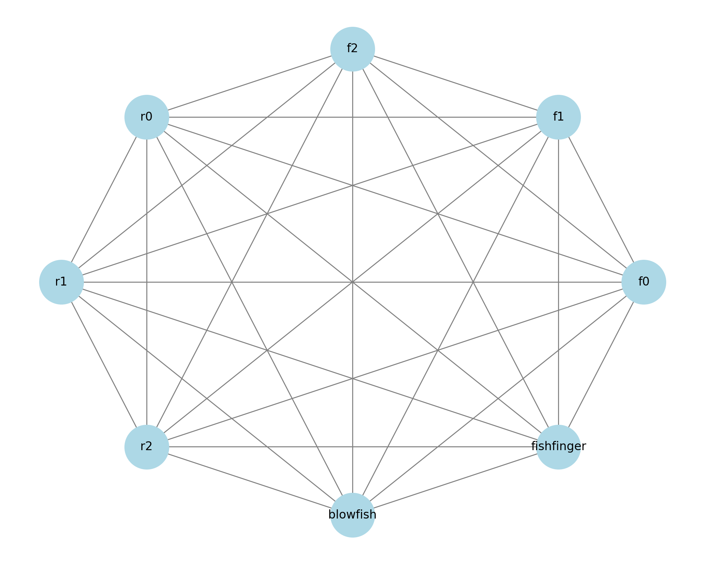

# WireGuard Mesh Generator

STILL WIP! The readme here are just notes for myself for a future blog post on f3s. Stay tuned!



## Installation

### FreeBSD

```sh
paul@f0:~ % doas freebsd-update fetch..... and so on... reboot
paul@f0:~ % doas pkg update
paul@f0:~ % doas pkg upgrade
paul@f0:~ % reboot

paul@f0:~ % doas pkg install wireguard-tools
paul@f0:~ % doas sysrc wireguard_interfaces=wg0
wireguard_interfaces:  -> wg0
paul@f0:~ % doas sysrc wireguard_enable=YES
wireguard_enable:  -> YES
paul@f0:~ % doas mkdir -p /usr/local/etc/wireguard
paul@f0:~ % doas touch /usr/local/etc/wireguard/wg0.conf
paul@f0:~ % doas service wireguard start
paul@f0:~ % cat <<END | doas tee -a /etc/hosts

192.168.2.130 f0.wg0 f0.wg0.wan.buetow.org
192.168.2.131 f1.wg0 f1.wg0.wan.buetow.org
192.168.2.132 f2.wg0 f2.wg0.wan.buetow.org

192.168.1.120 r0 r0.lan r0.lan.buetow.org
192.168.1.121 r1 r1.lan r1.lan.buetow.org
192.168.1.122 r2 r2.lan r2.lan.buetow.org

192.168.2.120 r0.wg0 r0.wg0.wan.buetow.org
192.168.2.121 r1.wg0 r1.wg0.wan.buetow.org
192.168.2.122 r2.wg0 r2.wg0.wan.buetow.org

192.168.2.110 blowfish.wg0 blowfish.wg0.wan.buetow.org
192.168.2.111 fishfinger.wg0 fishfinger.wg0.wan.buetow.org
END
```

### Rocky Linux 9

```sh
[root@r0 ~] dnf update -y
[root@r0 ~] reboot

[root@r0 ~] dnf install wireguard-tools
[root@r0 ~] mkdir -p /etc/wireguard
[root@r0 ~] touch /etc/wireguard/wg0.conf
[root@r0 ~] systemctl enable wg-quick@wg0.service
[root@r0 ~] systemctl start wg-quick@wg0.service
[root@r0 ~] systemctl disable firewalld
[root@r0 ~] cat <<END >>/etc/hosts

192.168.1.130 f0 f0.lan f0.lan.buetow.org
192.168.1.131 f1 f1.lan f1.lan.buetow.org
192.168.1.132 f2 f2.lan f2.lan.buetow.org

192.168.2.130 f0.wg0 f0.wg0.wan.buetow.org
192.168.2.131 f1.wg0 f1.wg0.wan.buetow.org
192.168.2.132 f2.wg0 f2.wg0.wan.buetow.org

192.168.2.120 r0.wg0 r0.wg0.wan.buetow.org
192.168.2.121 r1.wg0 r1.wg0.wan.buetow.org
192.168.2.122 r2.wg0 r2.wg0.wan.buetow.org

192.168.2.110 blowfish.wg0 blowfish.wg0.wan.buetow.org
192.168.2.111 fishfinger.wg0 fishfinger.wg0.wan.buetow.org
END
```

https://github.com/angristan/wireguard-install/discussions/499

```sh
[root@r0 ~] dnf install policycoreutils-python-utils
[root@r0 ~] semanage permissive -a wireguard_t
[root@r0 ~] reboot
```

### OpenBSD

https://docs.vultr.com/install-wireguard-vpn-server-on-openbsd-7-0

```sh
blowfish$ doas pkg_add wireguard-tools
blowfish$ doas mkdir /etc/wireguard
blowfish$ doas touch /etc/wireguard/wg0.conf
blowsish$ cat <<END | doas tee /etc/hostname.wg0
inet 192.168.2.110 255.255.255.0 NONE
up
!/usr/local/bin/wg setconf wg0 /etc/wireguard/wg0.conf
END
blowfish$
cat <<END | doas tee -a /etc/hosts

192.168.2.130 f0.wg0 f0.wg0.wan.buetow.org
192.168.2.131 f1.wg0 f1.wg0.wan.buetow.org
192.168.2.132 f2.wg0 f2.wg0.wan.buetow.org

192.168.2.120 r0.wg0 r0.wg0.wan.buetow.org
192.168.2.121 r1.wg0 r1.wg0.wan.buetow.org
192.168.2.122 r2.wg0 r2.wg0.wan.buetow.org

192.168.2.110 blowfish.wg0 blowfish.wg0.wan.buetow.org
192.168.2.111 fishfinger.wg0 fishfinger.wg0.wan.buetow.org
END
```

> By default, WireGuard tries to be as silent as possible when not being used; it is not a chatty protocol. For the most part, it only transmits data when a peer wishes to send packets. When it's not being asked to send packets, it stops sending packets until it is asked again. In the majority of configurations, this works well. However, when a peer is behind NAT or a firewall, it might wish to be able to receive incoming packets even when it is not sending any packets. Because NAT and stateful firewalls keep track of "connections", if a peer behind NAT or a firewall wishes to receive incoming packets, he must keep the NAT/firewall mapping valid, by periodically sending keepalive packets. This is called persistent keepalives. When this option is enabled, a keepalive packet is sent to the server endpoint once every interval seconds. A sensible interval that works with a wide variety of firewalls is 25 seconds. Setting it to 0 turns the feature off, which is the default, since most users will not need this, and it makes WireGuard slightly more chatty. This feature may be specified by adding the PersistentKeepalive = field to a peer in the configuration file, or setting persistent-keepalive at the command line. If you don't need this feature, don't enable it. But if you're behind NAT or a firewall and you want to receive incoming connections long after network traffic has gone silent, this option will keep the "connection" open in the eyes of NAT.

### Install the config

This generates the WireGuard config for my f3s project. This script is run on my Fedora Linux laptop.

## Installation

```sh
bundler install
sudo dnf install -y wireguard-tools
```

## Generate

```sh
rake generate
```

It will generate the configs and scp the configs to the hosts

Result:

```sh
❯ find keys
keys
keys/f0
keys/f0/privkey
keys/f0/pubkey
keys/f1
keys/f1/privkey
keys/f1/pubkey
keys/f2
keys/f2/privkey
keys/f2/pubkey
keys/r0
keys/r0/privkey
keys/r0/pubkey
keys/r1
keys/r1/privkey
keys/r1/pubkey
keys/r2
keys/r2/privkey
keys/r2/pubkey
```

```sh
rake install
```


